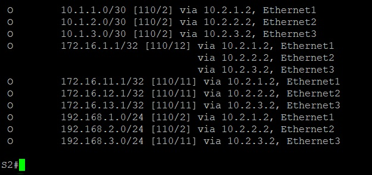

# Лабораторная работа №2. Underlay на основе OSPF

## Цель

Настроить OSPF для Underlay сети.

## Постановка задачи

Произвести настройку OSPF для обеспечения связности Underlay сети.

## Описание задачи

В поставленой задаче требуется произвести настройку протокола OSPF для побеспечения IP связности Underlay сети в рамках CLOS архитектуры. 

В качестве исходной, взять сеть из лабораторной работы №1.

# Введение

## Термины

- Underlay-сеть (сеть подложки) — физическая сеть, состоящая из аппаратных устройств, таких как коммутаторы и кабели, которая обеспечивает базовую связность и передачу пакетов
между физическими узлами
- Spine-Leaf (CLOS) архитектура - широко применяемая в рамках высоконагруженных сетей архитекрута сети, состоящая из Leaf устройств, обеспецивающих подключение конечный устройств, и 
Spine устройств, обеспечивающих связность нижестоящих Leaf устройств.
- OSPF - открытый протокол динамической маршрутизации с учетом состояния каналов (link-state), использующийся в IP-сетях для поиска наилучших маршрутов с применением алгоритма 
Дейкстры (SPF) для расчета кратчайших путей.

## Оборудование

1. Виртуальный коммутатор окружения Eve-NG на базе операционной системы vEOS версии EOS-4.29.2F
2. Виртуальный хост окружения Eve-NG

## Именование и термины

В качестве исходной сети была использована ранее спроектированная лабораторная сеть из Лаборатоной роботы №1. Все сетевые устройства имеют свои уникальные имена, отражающие их
функциональное назначение:

- S1 - Spine коммутатор №1
- S2 - Spine коммутатор №2

- L1 - Leaf коммутатор №1
- L2 - Leaf коммутатор №2
- L3 - Leaf коммутатор №3

- PC11 - Виртуальный хост №1, подкчобенный к Leaf коммутатору №1
- PC21 - Виртуальный хост №1, подкчобенный к Leaf коммутатору №2
- PC31 - Виртуальный хост №1, подкчобенный к Leaf коммутатору №3
- PC32 - Виртуальный хост №2, подкчобенный к Leaf коммутатору №3

### Таблица адресов сетевых устройств Spine

|N|Device|Port|IP Address|Prefix|
|:-:|:-:|:-:|:-:|:-:|
|1|S1|eth1|10.1.1.1|30|
|2|S1|eth2|10.1.2.1|30|
|3|S1|eth3|10.1.3.1|30|
|4|S2|eth1|10.2.1.1|30|
|5|S2|eth2|10.2.2.1|30|
|6|S2|eth3|10.2.3.1|30|

### Таблица адресов сетевых устройств Leaf

|N|Device|Port|IP Address|Prefix|
|:-:|:-:|:-:|:-:|:-:|
|1|L1|eth1|10.1.1.2|30|
|2|L1|eth2|10.2.1.2|30|
|3|L1|eth8|192.168.1.1|24|
|4|L2|eth1|10.1.2.2|30|
|5|L2|eth2|10.2.2.2|30|
|6|L2|eth8|192.168.2.1|24|
|7|L3|eth1|10.1.3.2|30|
|8|L3|eth2|10.2.3.2|30|
|9|L3|eth8|192.168.3.1|24|

### Таблица Loopback адресов сетевых устройств

|N|Device|Port|IP Address|Prefix|
|:-:|:-:|:-:|:-:|:-:|
|1|S1|Lo0|172.16.1.1|32|
|2|S2|Lo0|172.16.2.1|32|
|3|L1|Lo0|172.16.11.1|32|
|4|L2|Lo0|172.16.12.1|32|
|5|L3|Lo0|172.16.13.1|32|

### Таблица адресов конечных устройств

|N|Device|Port|IP Address|Prefix|
|:-:|:-:|:-:|:-:|:-:|
|1|PC11|eth0|192.168.1.10|24|
|2|PC21|eth0|192.168.2.10|24|
|3|PC31|eth0|192.168.3.10|24|
|4|PC32|eth0|192.168.3.11|24|

## Описание стенда

В рамках лабораторной работы на предоставленном учебным центром лабораторном окружении было использовано пять коммутаторов. Данные коммутаторы были соеденины линиями связи по схеме CLOS,
два из которых (S1 и S2) выступают в качестве Spine устройств, и три (L1,L2 и L3) в качестве Leaf устройств. Схема сети в рамках лабораторного окружения представлена на рисунке ниже


## Настройка устройств

В рамках учебной лабораторной среды на всех сетевых устройствах был настроен протокол OSPF. 

Ниже приведены частичные настройки файлов конфигураций сетевых устройств:

#### Spine устройства

**S1**

```
hostname S1
!
interface Ethernet1
   description <leaf L1>
   no switchport
   ip address 10.1.1.1/30
   ip ospf area 0.0.0.0
!
interface Ethernet2
   description <leaf L2>
   no switchport
   ip address 10.1.2.1/30
   ip ospf area 0.0.0.0
!
interface Ethernet3
   description <leaf L3>
   no switchport
   ip address 10.1.3.1/30
   ip ospf area 0.0.0.0
!
interface Loopback0
   ip address 172.16.1.1/32
   ip ospf area 0.0.0.0
!
ip routing
!
router ospf 1
   router-id 1.0.1.1
   auto-cost reference-bandwidth 1000
   passive-interface default
   no passive-interface Ethernet1
   no passive-interface Ethernet2
   no passive-interface Ethernet3
   max-lsa 12000
!
```

**S2**

```
hostname S2
!
interface Ethernet1
   description <leaf L1>
   no switchport
   ip address 10.2.1.1/30
   ip ospf area 0.0.0.0
!
interface Ethernet2
   description <leaf L2>
   no switchport
   ip address 10.2.2.1/30
   ip ospf area 0.0.0.0
!
interface Ethernet3
   description <leaf L3>
   no switchport
   ip address 10.2.3.1/30
   ip ospf area 0.0.0.0
!
interface Loopback0
   ip address 172.16.2.1/32
   ip ospf area 0.0.0.0
!
ip routing
!
router ospf 1
   router-id 1.0.1.2
   auto-cost reference-bandwidth 1000
   passive-interface default
   no passive-interface Ethernet1
   no passive-interface Ethernet2
   no passive-interface Ethernet3
   max-lsa 12000
!
```

#### Leaf устройства

**L1**

```
hostname L1
!
interface Ethernet1
   description <spine S1>
   no switchport
   ip address 10.1.1.2/30
   ip ospf area 0.0.0.0
!
interface Ethernet2
   description <spine S2>
   no switchport
   ip address 10.2.1.2/30
   ip ospf area 0.0.0.0
!
interface Ethernet8
   description <PC11>
   no switchport
   ip address 192.168.1.1/24
   ip ospf area 0.0.0.0
!
interface Loopback0
   ip address 172.16.11.1/32
   ip ospf area 0.0.0.0
!
ip routing
!
router ospf 1
   router-id 0.0.2.1
   auto-cost reference-bandwidth 1000
   passive-interface default
   no passive-interface Ethernet1
   no passive-interface Ethernet2
   max-lsa 12000
!
```

**L2**

```
hostname L2
!
interface Ethernet1
   description <spine S1>
   no switchport
   ip address 10.1.2.2/30
   ip ospf area 0.0.0.0
!
interface Ethernet2
   description <spine S2>
   no switchport
   ip address 10.2.2.2/30
   ip ospf area 0.0.0.0
!
interface Ethernet8
   description <PC21>
   no switchport
   ip address 192.168.2.1/24
   ip ospf area 0.0.0.0
!
interface Loopback0
   ip address 172.16.12.1/32
   ip ospf area 0.0.0.0
!
ip routing
!
router ospf 1
   router-id 0.0.2.2
   auto-cost reference-bandwidth 1000
   passive-interface default
   no passive-interface Ethernet1
   no passive-interface Ethernet2
   max-lsa 12000
!
```

**L3**

```
hostname L3
!
vlan 3
   name users
!
interface Ethernet1
   description <spine S1>
   no switchport
   ip address 10.1.3.2/30
   ip ospf area 0.0.0.0
!
interface Ethernet2
   description <spine S2>
   no switchport
   ip address 10.2.3.2/30
   ip ospf area 0.0.0.0
!
interface Ethernet7
   description <PC31>
   switchport access vlan 3
!
interface Ethernet8
   description <PC32>
   switchport access vlan 3
!
interface Loopback0
   ip address 172.16.13.1/32
   ip ospf area 0.0.0.0
!
interface Vlan3
   description <User`s VLAN>
   ip address 192.168.3.1/24
   ip ospf area 0.0.0.0
!
ip routing
!
router ospf 1
   router-id 0.0.2.3
   auto-cost reference-bandwidth 1000
   passive-interface default
   no passive-interface Ethernet1
   no passive-interface Ethernet2
   max-lsa 12000
!
```

## Описание типовых настроек

В качестве таповых настроек было произведено распределение router-id, обеспечивающий выбор маршрутизатором DR устройств из Spine уровня. Так же по умолчани был включен режим
пассивности сетевых интерфейсов, отключающий активность протокола OSPF на всех интерфейсах, кроме тех, что были принудительно разрешены.


# Заключение

## Проверка работы сденда и результаты работы

Стенд может считаться рабочим в случае установления IP связности между всеми устройствами в рамках лабораторной сети, как следствие появления на всех устройствах в таблице
маршрутизации информации обо всех IP адресах интерфейсов иных устройствах. Тесты работы производился посредством отправики ICMP Echo запроса. 

**Таблица маршрутизации OSPF на коммутаторе S1**


**Таблица маршрутизации OSPF на коммутаторе S2**



**Таблица маршрутизации OSPF на коммутаторе L1**


**Таблица маршрутизации OSPF на коммутаторе L2**


**Таблица маршрутизации OSPF на коммутаторе L3**


## Вывод

Был подготовлен рабочий стенд, собранный в соответствии с CLOS архитекрурой. Произведены испытания, показавшие наличие IP доступности сетевых усторйств между уровнями Spine и Leaf, а тке же уровнями Leaf и Конечные устройства